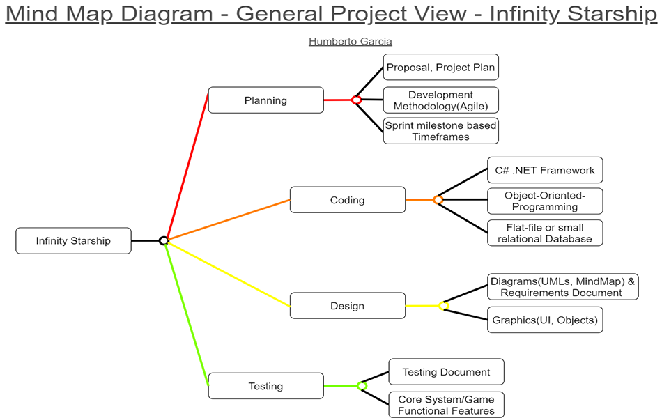
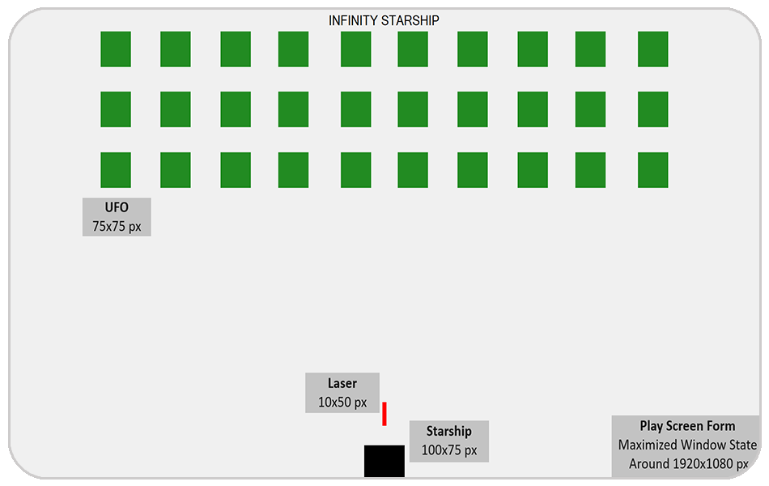
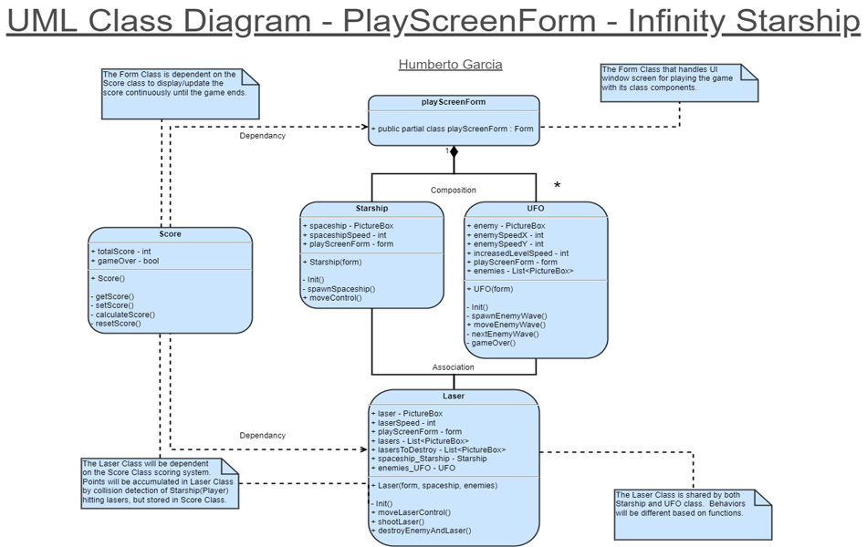
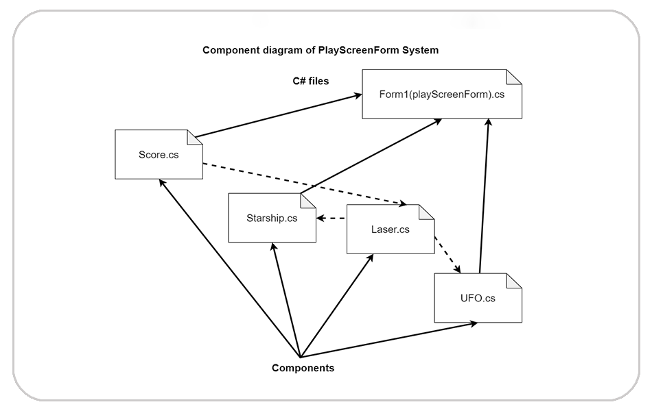

# :rocket::space_invader: Infinity Starship


## Description

#### Summary
Infinity Starship is a windows form desktop game app inspired by "Space Invaders".  Using Visual Studio 2019, the purpose of the project was to recreate in my own style a old school arcade classic with C# .NET framework.  Personal development of it was done with an agile-like feature-driven approach alongside object-oriented design and programming.

#### ‎Demonstration
 - Start of the player game run through a level wave:

https://github.com/HumbertoGarciaJr/InfinityStarship-GarciaHumberto/assets/125167736/c543cc8b-afc0-470b-97b7-109873fa4195

 - End of the player game run, storing their final score into the leaderboard:

https://github.com/HumbertoGarciaJr/InfinityStarship-GarciaHumberto/assets/125167736/15198181-9e12-4911-bf7f-8b777f41554a

## Installation

#### Build Releases
 - Current release: [Infinity Starship v1.0.0](https://github.com/HumbertoGarciaJr/InfinityStarship-GarciaHumberto/releases/tag/v1.0.0)

#### Create Repository Locally

1. **Copy** the repository using the web URL.

```bash
https://github.com/HumbertoGarciaJr/InfinityStarship-GarciaHumberto.git
```

2. Open **Git Bash** terminal.

3. Change the directory to the location you want the repository to be in.

4. Type the command `git clone`, and **Paste** the web url copied earlier.

```bash
git clone https://github.com/HumbertoGarciaJr/InfinityStarship-GarciaHumberto.git
```

5. Press **Enter**, and the repository should be successfully cloned and created with local access to it.

## Development Screenshots/Examples

**Design diagram of mind map brainstorming the project scope and software tools.**



<div align="center">
<p align="center">- Early phase mockup visual view of Infinity Starship.</p>

</div>
<div>‎ </div>

**Design class diagram of play screen form window objects encapsulation, attributes/data, and their relationships.**



<div align="center">
<p align="center">- A high-level view of the play screen form window system.</p>

</div>
<div>‎ </div>

**Example code snippet of playScreenForm implementation of the class object components and running the game state.**

```c#
//Function event playScreenForm_Load to Load on Startup of playScreenForm form
private void playScreenForm_Load(object sender, EventArgs e)
{
	//Store new Class Starship into spaceship
	spaceship = new Starship(this);//initialize spaceship obj accessing Class Starship in this(playScreenForm) form
	//Store new Class UFO into enemies
	enemies = new UFO(this);//initialize enemies obj accessing Class UFO in this(playScreenForm) form
	//Store new Class Laser into lasers
	lasers = new Laser(this, spaceship, enemies);//initialize lasers obj accessing Class Laser in this(playScreenForm) form
}

//Function event playScreenForm_KeyDown to Occur when the Key is being pressed down
private void playScreenForm_KeyDown(object sender, KeyEventArgs e)
{
	//If Statement if gameOver of Class Score is false
	if (Score.gameOver == false)
	{
		//Call Function moveControl of spaceship
		spaceship.moveControl(e);
		//Call Function moveLaserControl of lasers
		lasers.moveLaserControl(e);
	}
}
```

**Example code snippet of the main Starship and UFO objects with their fundamental properties constructor.**

<p align="center">- The Starship class object spaceship properties constructor.</p>

```c#
//Store new class PictureBox into spaceship object
spaceship = new PictureBox()
{//spaceship Properties Constructor
	Image = pictureBox.Image,
	BackColor = Color.Transparent,
	Width = 100,
	Height = 75,
	Visible = true,
	Left = (form.ClientSize.Width - 100) / 2,
	Top = (form.ClientSize.Height - 100)
};
```

<div>‎ </div>
<p align="center">- The UFO class object enemies properties constructor.</p>

```c#
//Call Function Add of enemies(To store new class PictureBox into enemies list)
enemies.Add(new PictureBox()
{//enemies list Properties Constructor
	Image = imageList.Images[0],
	BackColor = Color.Transparent,
	Width = 75,
	Height = 75,
	Visible = true,
	Left = 725,
	Top = 100,
	Tag = "Enemy"
});
```

## Authors

- [@HumbertoGarciaJr](https://github.com/HumbertoGarciaJr)
